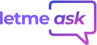
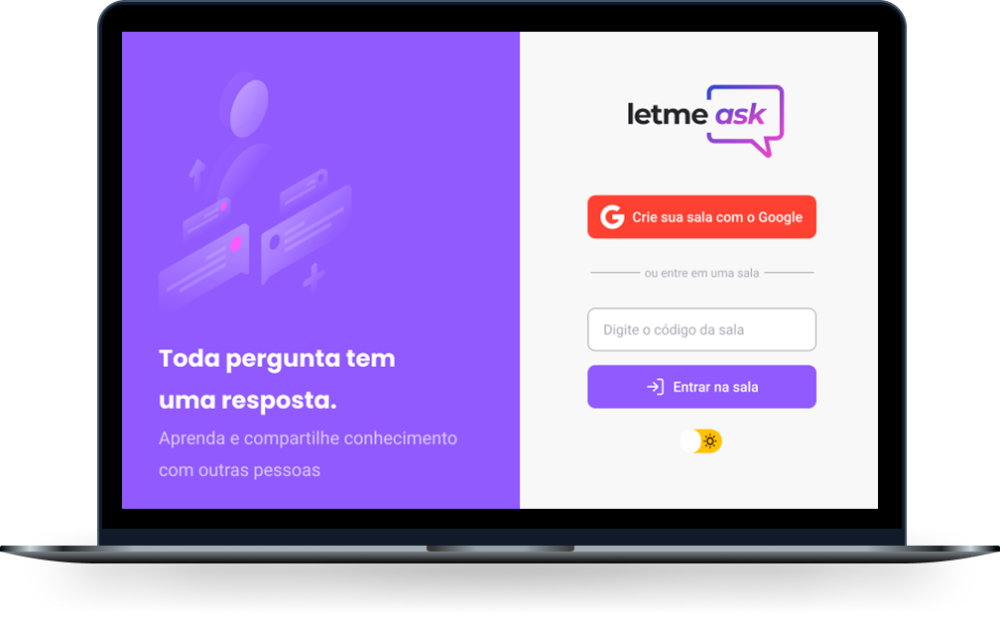

<h1 align="center">
  
</h1>

  

 

  <a href="#-tecnologias">Tecnologias</a> •
  <a href="#-projeto">Projeto</a> •
  <a href="#-layout">Layout</a> •
  <a href="#-como-acessar">Como acessar</a> •
  <a href="#-autor">Autor</a> •
  <a href="#-licença">Licença</a>

<h4 align="center"> 
	🚧  Em construção   🚧
</h4>
 

  

## 🛠 Tecnologias

Esse projeto foi desenvolvido com as seguintes tecnologias:

- [React](https://reactjs.org)
- [TypeScript](https://www.typescriptlang.org/)
- [Firebase](https://firebase.google.com/)

## 💻 Projeto

O letmeask é um app criado durante a Next Level Week 6 - Together para Q&A com a possibilidade de votação em perguntas, para que as mais votadas tenham prioridade de resposta.

## 🔖 Layout

Você pode visualizar o layout do projeto através [`desse link`](https://www.figma.com/file/SBKyVhBHqZsFjN0ouLfry9/Letmeask?node-id=0%3A1). É necessário ter conta no [Figma](http://figma.com/) para acessá-lo.

## 🚀 Como acessar

Você pode acessar a aplicação através [`deste link`](https://letmeask-978ba.web.app/) em seu navegador.

## ✍🏾 Autor
<a  href="https://github.com/viniciusoliveiras/">
 
  
 
Vinícius Oliveira

</a>

  
  

## 📄 Licença

Esse projeto está sob a licença MIT. Veja o arquivo [LICENSE](LICENSE) para mais detalhes.
